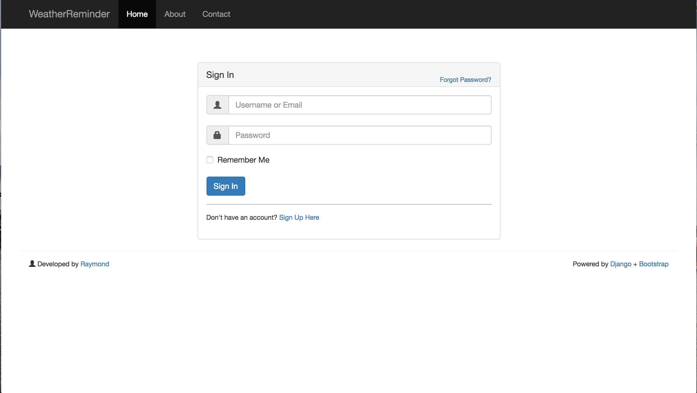
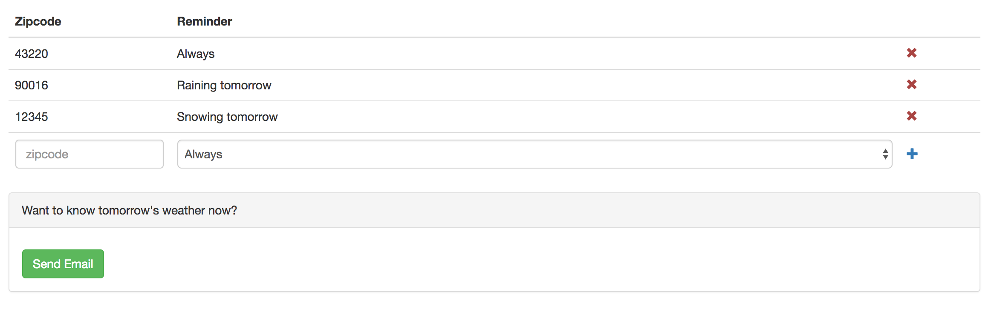

## Description

Weather Reminder is a web app using Django framework to remind people of tomorrow's weather change

## functionality
1.User sign up

2. Add zip codes in your area to get weather information and send email

## Sending Email

Edit the weather/email_config.jason file. Replace the email with your yahoo email to use the yahoo server to send user weather reminder

## Purpose

This project is the practice of web development including Django and bootstrp

## API Reference

This project is using [Yahoo Weather API](https://developer.yahoo.com/weather/#get-started) to fetch the data of weather information

## License

MIT is open-sourced software licensed under the [MIT license](http://opensource.org/licenses/MIT).

## Future Development

+ Add more options of weather reminder(such as temparature can drop at 3-10F)
+ Try something else weather API to get the weather information because yahoo weather is not very stable
+ Deploy this project on cloud server such as Amazon EC2 